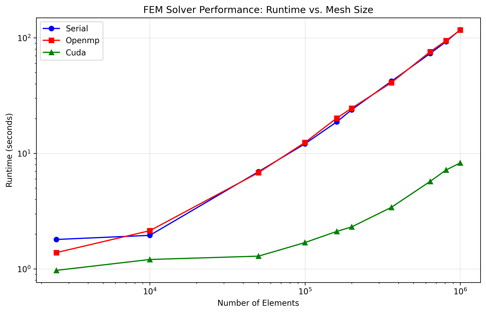
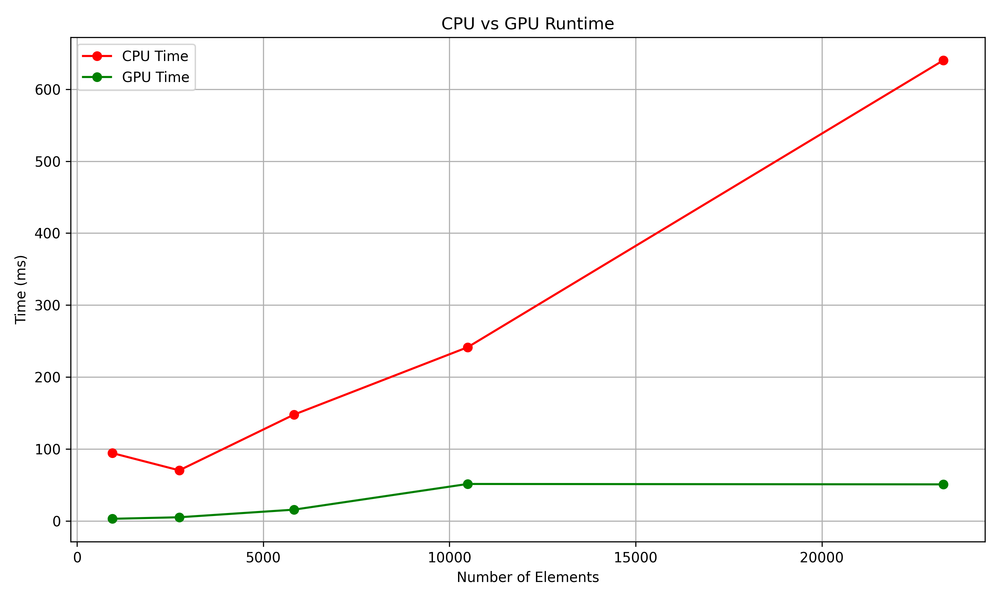
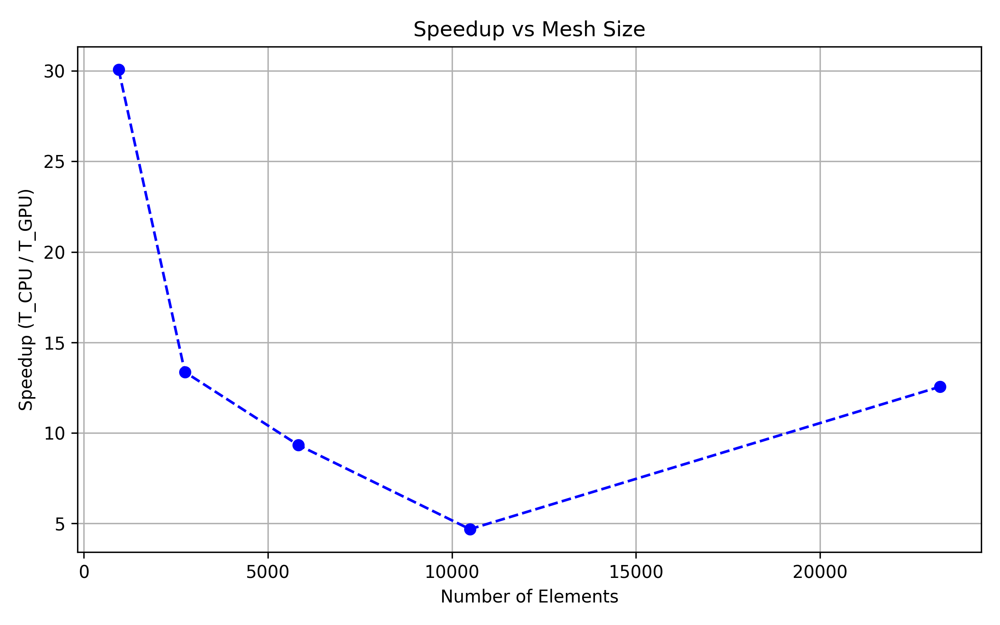
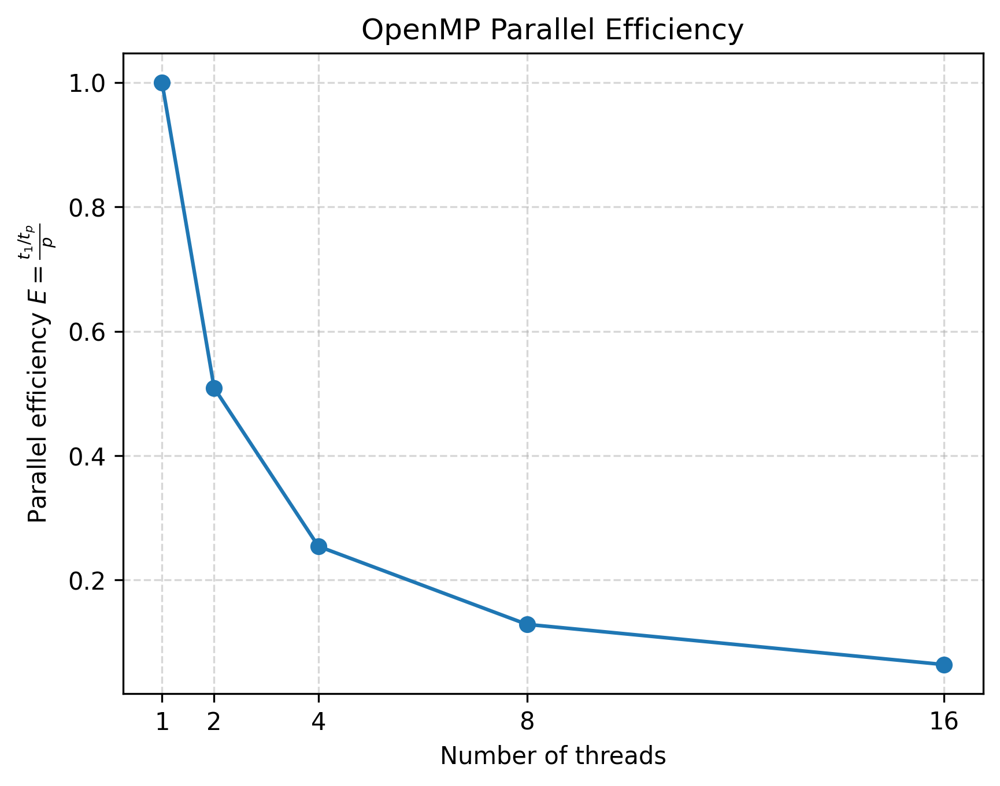

# Assignment2-Group2
Scott Blender - Part 2(A), 2(F) \
Bibek Shrestha - Part 2(B), 3(A), 3(C) \
Kairvi Lodhiya - Part 2(C), 2(D), 2(E), 3(B)

# To build follow these instructions
>> cmake -B build \
    -DKokkos_ENABLE_OPENMP=OFF \ #(OFF for Serial and CUDA & ON for OPENMP) \
    -DKokkos_ENABLE_CUDA=OFF \ #(OFF for Serial and OPENMP & ON for CUDA) \
    . \
>> cd build & make -j${NPROC}

# To run the solver 
- add your mesh.msh file to the build folder and run
>> ./fem_main "mesh.msh file" "function(x,y) of your choice (eg. x2y)" "gpu for parallel or leave blank for serial"

# Performance characteristics
## Runtime comparision

## Runtime comparision for CPU and GPU

## Speed up

## OpenMP parallel efficiency for 160000 mesh element

